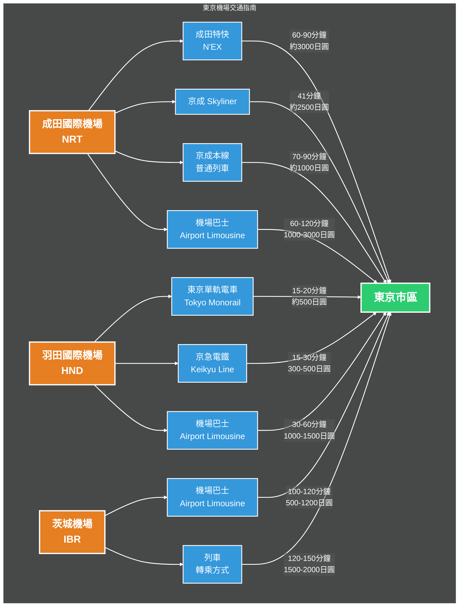

# 東京機場交通指南

東京有三個主要機場：成田國際機場（NRT）、羽田國際機場（HND）和茨城機場（IBR）。以下是從這些機場到東京市區的交通選擇。

## 成田國際機場（NRT）→ 東京市區

### 成田特快（Narita Express, N'EX）

- **時間**：60-90 分鐘
- **價格**：約 3000 日圓
- **優點**：
  - 直達東京站、新宿、池袋等主要車站
  - 舒適度高
  - 有專門的行李存放區
- **購票**：可在機場的 JR 售票處或自動售票機購買
- **班次**：每 30-60 分鐘一班

### 京成 Skyliner

- **時間**：約 41 分鐘（到日暮里）
- **價格**：約 2500 日圓
- **優點**：
  - 速度最快
  - 連接日暮里和上野
  - 舒適的座位和寬敞的空間
- **購票**：可在機場的京成售票處或線上預訂
- **班次**：每 20-40 分鐘一班

### 京成本線普通列車

- **時間**：70-90 分鐘
- **價格**：約 1000 日圓
- **優點**：
  - 經濟實惠
  - 可使用西瓜卡（Suica）或 PASMO 卡
- **缺點**：較慢，可能需要站立
- **班次**：每 15-20 分鐘一班

### 機場巴士（Airport Limousine Bus）

- **時間**：60-120 分鐘（視交通狀況而定）
- **價格**：1000-3000 日圓
- **優點**：
  - 直達市內主要酒店或景點
  - 適合不想搬運行李的旅客
  - 舒適的座位
- **購票**：可在機場的巴士售票處或線上預訂
- **班次**：視目的地而定，通常每 30-60 分鐘一班

## 羽田國際機場（HND）→ 東京市區

### 東京單軌電車（Tokyo Monorail）

- **時間**：15-20 分鐘（到濱松町）
- **價格**：約 500 日圓
- **優點**：
  - 連接山手線，快速抵達市中心
  - 景色優美，可欣賞東京灣
- **班次**：每 4-10 分鐘一班

### 京急電鐵（Keikyu Line）

- **時間**：15-30 分鐘（到品川）
- **價格**：300-500 日圓
- **優點**：
  - 價格便宜
  - 轉乘方便，可直接連接地鐵
- **班次**：每 5-10 分鐘一班

### 機場巴士（Airport Limousine Bus）

- **時間**：30-60 分鐘
- **價格**：1000-1500 日圓
- **優點**：
  - 直達市區酒店和景點
  - 舒適，適合攜帶行李的旅客
- **班次**：視目的地而定，通常每 15-30 分鐘一班

## 茨城機場（IBR）→ 東京市區

### 機場巴士（Airport Limousine Bus）

- **時間**：100-120 分鐘
- **價格**：500-1200 日圓
- **優點**：
  - 無需轉乘，直達東京站或秋葉原站
  - 價格實惠
- **班次**：配合航班時間，通常每 1-2 小時一班

### 列車（轉乘方式）

- **路線**：茨城機場 → 連絡巴士到石岡站 → JR 常磐線 → 東京
- **時間**：120-150 分鐘
- **價格**：1500-2000 日圓
- **優點**：
  - 利用常磐線列車，適合想靈活轉乘的旅客
  - 適合要在關東東北方郊區或從日本東北下來不經過東京市區的人。
  - 可欣賞沿途風景
- **注意**：需要多次轉乘，不適合攜帶大量行李的旅客

## 相關資訊來源

- [成田國際機場官方網站](https://www.narita-airport.jp/ch2/)
- [羽田機場官方網站](https://tokyo-haneda.com/zh-CHT/index.html)
- [茨城機場官方網站](https://www.ibaraki-airport.net/en/)
- [JR 東日本 - 成田特快](https://www.jreast.co.jp/tc/nex/)
- [京成電鐵 - Skyliner](https://www.keisei.co.jp/keisei/tetudou/skyliner/tc/index.php)
- [東京 Metro 地鐵官方網站](https://www.tokyometro.jp/tcn/)
- [Airport Limousine Bus 官方網站](https://www.limousinebus.co.jp/en/)
- [東京觀光官方網站 - 交通資訊](https://www.gotokyo.org/tc/plan/getting-around/index.html)
