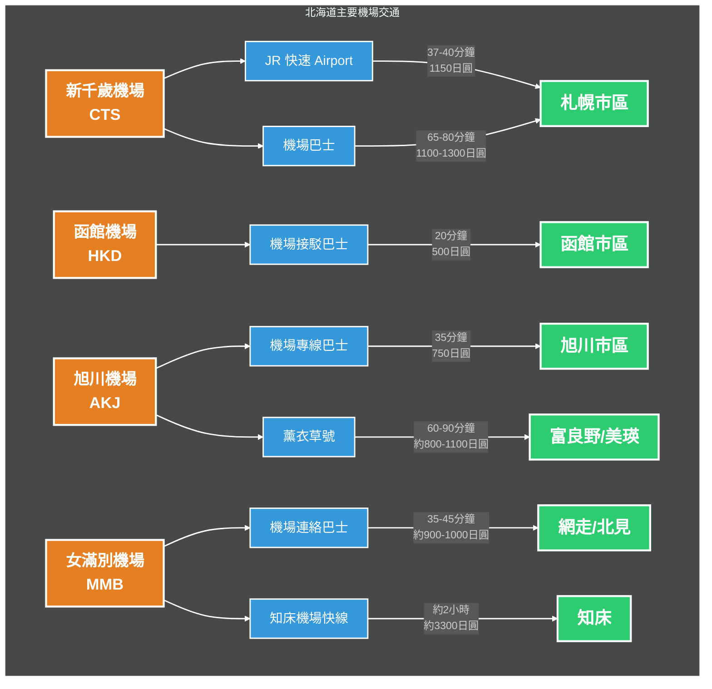

# 北海道機場交通指南

北海道擁有數個主要機場，其中以新千歲機場（CTS）為最主要的國際與國內線門戶。此外，函館機場（HKD）、旭川機場（AKJ）與女滿別機場（MMB）也是重要的交通樞紐。

## 新千歲機場 (CTS) - **[札幌](../札幌/)** 的門戶

新千歲機場位於千歲市，是進入北海道最主要的機場。

### JR 快速 Airport (Rapid Airport)

* **起訖點**：新千歲機場 ↔ **[札幌](../札幌/)**、**[小樽](../小樽/)**
* **所需時間**：到札幌約 37-40 分鐘
* **費用**：1,150 日圓（普通車廂自由席），指定席需加收 840 日圓
* **時刻表**：[JR 北海道新千歲機場站時刻表](https://www.jrhokkaido.co.jp/network/index_airport.html)
* **優點**：速度最快、班次密集（每 12 分鐘一班）。
* **購票**：可使用 Suica, Kitaca 等 IC 卡，或在 JR 售票機購買。

### 機場巴士 (Hokkaido Chuo Bus / Hokuto Kotsu)

* **起訖點**：新千歲機場 ↔ **[札幌](../札幌/)** 市內各區（包含 **[大通](../札幌/景點/大通公園)**、薄野）、定山溪溫泉
* **所需時間**：到札幌市中心約 65-80 分鐘（視交通狀況）
* **費用**：約 1,100 - 1,300 日圓
* **時刻表**：[新千歲機場巴士時刻表 (北都交通)](https://www.hokutokotsu.com/airport/sapporo.html) / [中央巴士](https://www.chuo-bus.co.jp/airport/)
* **優點**：可直達部分主要飯店，無需搬運行李轉乘。
* **班次**：約 15-30 分鐘一班。

## 函館機場 (HKD) - **[函館](../函館/)** 門戶

### 機場接駁巴士 (Shuttle Bus)

* **起訖點**：函館機場 ↔ **[函館站](../函館/)**、**[五稜郭](../函館/景點/五稜郭公園)**、湯之川溫泉
* **所需時間**：到函館站約 20 分鐘
* **費用**：約 500 日圓
* **時刻表**：[函館帝產巴士官網 (機場接駁)](https://www.hakotaxi.co.jp/bus/shuttlebus.shtml)
* **優點**：配合航班時間發車，非常方便。

## 旭川機場 (AKJ) - **[旭川](../旭川/)**/美瑛富良野門戶

### 機場專線巴士

* **起訖點**：旭川機場 ↔ **[旭川](../旭川/)** 市中心
* **所需時間**：約 35 分鐘
* **費用**：750 日圓
* **時刻表**：[旭川電氣軌道巴士時刻表](https://www.asahikawa-denkikidou.jp/airport/)

### 薰衣草號 (Lavender Bus)

* **起訖點**：旭川機場 ↔ **[美瑛](../美瑛/)**、**[富良野](../富良野/)**
* **所需時間**：到美瑛約 15 分鐘，到富良野約 60 分鐘
* **費用**：到美瑛約 400 日圓，到富良野約 1,000 日圓
* **時刻表**：[富良野巴士官網 (薰衣草號)](https://www.furanobus.jp/lavender/)
* **備註**：適合要去賞花的旅客，直接從機場前往景區。

## 女滿別機場 (MMB) - 道東/知床門戶

### 機場連絡巴士

* **起訖點**：女滿別機場 ↔ **[網走](../網走/)** 市區（網走站、網走巴士總站）、北見市區
* **所需時間**：到網走站約 35 分鐘，到北見站約 42 分鐘
* **費用**：到網走約 910 日圓，到北見約 1,000 日圓
* **時刻表**：[網走巴士官網 (女滿別機場線)](https://www.abashiribus.com/airport/)

### 知床機場快線 (Shiretoko Airport Liner)

* **起訖點**：女滿別機場 ↔ 知床斜里、**[知床](../知床/)** 溫泉 (Utoro)
* **所需時間**：到 Utoro 約 2 小時
* **費用**：約 3,300 日圓
* **時刻表**：[斜里巴士官網 (知床機場快線)](https://www.sharibus.co.jp/bus2.html)
* **備註**：通常僅在夏季與冬季（流冰季節）運行，建議事先確認班次。

## 相關連結

* [新千歲機場官方網站](https://www.new-chitose-airport.jp/tw/)
* [函館機場官方網站](https://www.hokkaido-airports.com/ja/hakodate/)
* [旭川機場官方網站](https://www.hokkaido-airports.com/ja/asahikawa/)
* [女滿別機場官方網站](https://www.hokkaido-airports.com/ja/memanbetsu/)
* [JR 北海道官方網站](https://www.jrhokkaido.co.jp/global/chinese/index.html)
